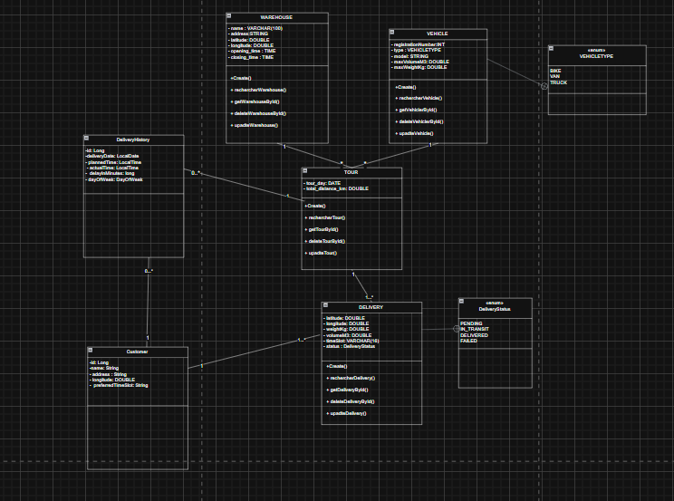

#  Système de Gestion Optimisée de Tournées de Livraison - V2.0 

## Description du projet
Ce projet est l'évolution (**V2.0**) d'une application web **Spring Boot (V1)** visant à **optimiser les tournées de livraison**.  
Cette nouvelle version étend les fonctionnalités existantes en intégrant des technologies avancées, notamment :

- **L’intelligence artificielle via Spring AI** pour une optimisation dynamique.
- **Liquibase** pour la gestion des migrations de la base de données.

### Objectifs (V2.0)
L'application mise à jour permet de :
- Gérer les entités de base : `Vehicles`, `Deliveries`, `Warehouses`.
- **(Nouveau)** Gérer les `Customers` et leur `DeliveryHistory`.
- **(Nouveau)** Implémenter un troisième algorithme `AlOptimizer` utilisant **Spring AI**.
- **(Nouveau)** Gérer les migrations BDD (de V1 à V2) avec **Liquibase**.
- **(Nouveau)** Utiliser une configuration **YAML (.yml)** avec profils `dev`, `qa`.
- **(Nouveau)** Conteneuriser l’application avec **Docker**.
- Fournir une **API REST complète** pour le CRUD et le déclenchement des optimisations.

---

##  Évolution majeure : V1 (XML) → V2 (Annotations)
La contrainte principale de la **V1** était l’injection de dépendances manuelle via `applicationContext.xml`.  
Cette contrainte est **supprimée** dans la **V2**.

Le projet a été entièrement migré vers une configuration moderne basée sur les **annotations Spring** :
`@Autowired`, `@Service`, `@Component`, `@Repository`, `@ConditionalOnProperty`.

###  Objectif pédagogique
> Maîtriser la configuration moderne de Spring Boot, l’intégration IA (Spring AI), la gestion des BDD (Liquibase) et la conteneurisation (Docker).

---


# Schéma Récapitulatif des Technologies - Système de Gestion Optimisée de Tournées de Livraison V2
### Architecture Générale


# class diagram : 



## 🛠️ 3. Technologies utilisées

| Technologie | Description |
|--------------|-------------|
| **Java 17** | Langage principal (Stream API, Java Time API) |
| **Spring Boot 3.x** | Framework principal (Web, Data JPA) |
| **Spring AI (DeepSeek)** | *(Nouveau)* Optimisation IA avec LLM |
| **Liquibase** | *(Nouveau)* Gestion des migrations BDD |
| **Spring Data JPA** | Repositories et requêtes personnalisées |
| **H2 Database** | Base pour l’environnement `dev` |
| **PostgreSQL** | *(Nouveau)* Base pour l’environnement `qa` |
| **Docker** | *(Nouveau)* Conteneurisation |
| **Maven** | Build & gestion des dépendances |
| **Lombok** | Réduction du boilerplate (`@Data`, `@Builder`) |
| **Springdoc OpenAPI** | Documentation Swagger |
| **JUnit 5 & Mockito** | Tests unitaires et d’intégration |

---

## 4. Instructions d’exécution

###  Prérequis
- **JDK 17** ou supérieur
- **Maven** installé
- *(Optionnel)* **Docker Desktop**
- **Clé API DeepSeek** à ajouter dans :

src/main/resources/application-dev.yml

```yaml
spring:
  ai:
    deepseek:
      api-key: "VOTRE_CLÉ_API_DEEPSEEK_ICI"
```

# Option 1 : Exécution locale (profil dev, base H2)

``` bash

git clone https://github.com/ABDERRAZZAK-IMILY/Syst-me-de-Gestion-Optimis-e-de-Tourn-es-de-Livraison-.git
cd Syst-me-de-Gestion-Optimis-e-de-Tourn-es-de-Livraison-
mvn spring-boot:run

```

# Option 2 : Exécution avec Docker

Construire l’image :
---
docker build -t delivery-optimizer .
---
Lancer le conteneur :

```
docker run -p 8080:8080 \
-e SPRING_PROFILES_ACTIVE=qa \
-e SPRING_DATASOURCE_URL=jdbc:postgresql://host.docker.internal:5432/delivery_qa_db \
-e SPRING_DATASOURCE_USERNAME=qa_user \
-e SPRING_DATASOURCE_PASSWORD=qa_password \
-e SPRING_AI_DEEPSEEK_API_KEY=VOTRE_CLÉ_API \
--name delivery-app \
delivery-optimizer

```

#  Accès aux outils intégrés
Outil	URL / Détails
H2 Console (profil dev)	http://localhost:8080/h2-console

JDBC URL	jdbc:h2:file:~/deliverydb
Username	sa
Password	(vide)
Swagger UI	http://localhost:8080/swagger-ui.html

#  Structure du projet (V2)
```
com.logistics.delivery_optimizer
├── controller/       # Couche API (Annotations @RestController)
├── dto/              # Data Transfer Objects
├── mapper/           # Conversion DTO <-> Entity
├── model/            # Entités JPA & Enums
│   ├── Customer.java
│   └── DeliveryHistory.java
├── repository/       # Repositories Spring Data JPA
├── service/          # Logique métier (@Service)
│   ├── optimizer/
│   │   ├── TourOptimizer.java
│   │   ├── NearestNeighborOptimizer.java
│   │   ├── ClarkeWrightOptimizer.java
│   │   └── AlOptimizer.java   # Nouveau - IA
├── util/             # Classes utilitaires
├── exception/        # Gestion globale des exceptions
├── DeliveryOptimizerApplication.java
└── resources/
├── application.yml
├── application-dev.yml
├── application-qa.yml
└── db/changelog/db.changelog.master.yaml
```
# Algorithmes d’optimisation
Algorithme	Description	Avantages	Inconvénients
Nearest Neighbor	Choisit la livraison la plus proche	Très rapide	Souvent sous-optimal
Clarke & Wright	Fusionne les trajets selon les “économies”	Distance réduite	Plus complexe
AlOptimizer (IA)	(Nouveau) Analyse l’historique via Spring AI	Adaptatif, auto-apprenant	Dépendance LLM (coût/latence)
# Activation via application.yml
app:
optimization:
# Options : 'nearest_neighbor', 'clarke_wright', 'ai'
algorithm: ai

# Tests

Les tests unitaires et d’intégration sont situés dans :
```
src/test/java/
```

Pour les exécuter :
```
mvn test
```
#  Auteur

Développé par : IMILY ABDERRAZZAK

Développeur Full-Stack